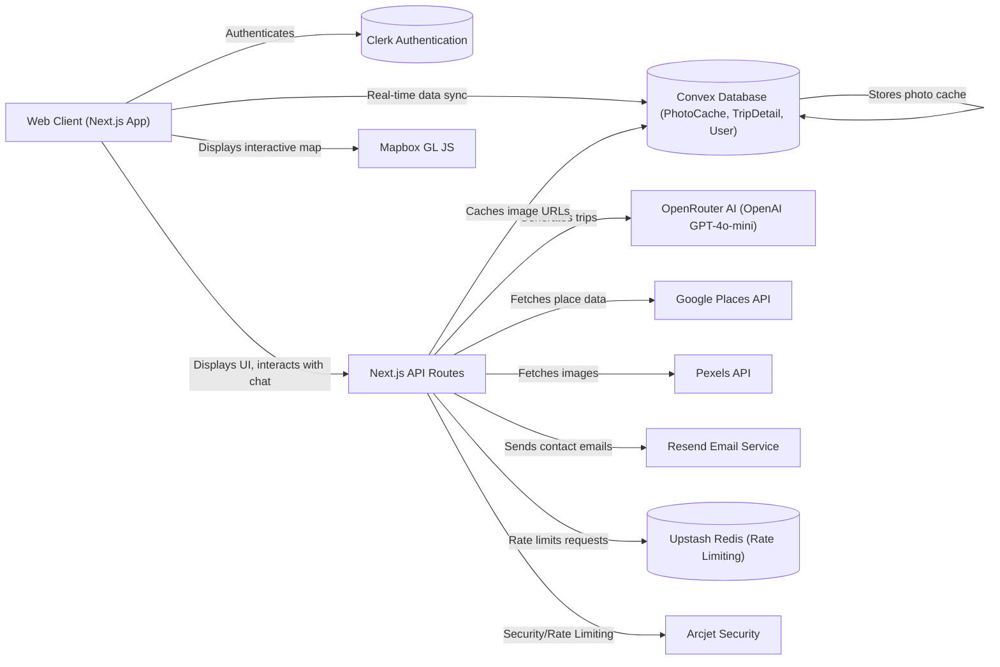

# AI Trip Planner

This project is your personal AI travel assistant. You tell it where you want to go, for how long, and with what budget, and it creates a full trip itinerary, including hotel suggestions and daily activities. It takes the hassle out of planning, giving you a detailed, personalized travel plan in seconds.

## Features

Here are some of the key things you can do with AI Trip Planner:

*   **AI-Powered Trip Generation**: Describe your desired trip in natural language, and the AI will craft a comprehensive itinerary, complete with destination, duration, budget, suggested hotels, and a daily activity breakdown.
    ```mermaid
    sequenceDiagram
        actor User
        participant Frontend as "Next.js Frontend"
        participant API as "Next.js /api/AI-model"
        participant OpenRouter as "OpenRouter (OpenAI GPT-4o-mini)"
        participant Convex as "Convex DB"

        User->>Frontend: Enters trip details in chat
        Frontend->>API: POST /api/AI-model (messages, viewTrip)
        API->>OpenRouter: Request chat completion (system prompt, user messages)
        OpenRouter-->>API: AI-generated trip plan (JSON)
        API-->>Frontend: Trip plan data + UI state
        alt If trip plan is finalized
            Frontend->>Convex: Call createTripDetail mutation (tripDetail, tripId, userId)
            Convex-->>Frontend: Persist trip details
        end
        Frontend->>User: Display itinerary / interactive UI options
    ```
*   **Personalized Itineraries**: Get a day-by-day plan of activities, including recommended places to visit, best times, and estimated durations.
*   **Hotel Suggestions**: Receive curated hotel options with details like address, price per night, and ratings, enriched with real images.
*   **Interactive Map View**: Visualize your entire trip on a global map, with markers for all suggested activities.
*   **User Authentication**: Securely sign in and manage your past and current trip plans.
    ```mermaid
    sequenceDiagram
        actor User
        participant Browser
        participant Frontend as "Next.js Frontend"
        participant ClerkUI as "Clerk Sign-In/Up UI"
        participant ClerkBackend as "Clerk Backend Service"
        participant ClerkMiddleware as "Next.js Clerk Middleware"

        User->>Frontend: Navigates to protected route or clicks Sign In
        Frontend->>ClerkUI: Renders Clerk Sign-In/Up Component
        User->>ClerkUI: Enters credentials / Clicks OAuth
        ClerkUI->>ClerkBackend: Authenticates user
        ClerkBackend-->>Browser: Sets authentication cookies
        Browser->>Frontend: Subsequent requests with Clerk cookies
        Frontend->>ClerkMiddleware: Intercepts request
        ClerkMiddleware->>ClerkBackend: Validates session
        ClerkBackend-->>ClerkMiddleware: Session valid
        ClerkMiddleware-->>Frontend: Allow request (user context available)
        Frontend->>User: Displays protected content / personalized UI
    ```
*   **Trip Management**: Easily view all your previously generated trip plans and revisit their details.
*   **Dynamic UI with AI Feedback**: The chat interface adapts, offering specific input options (like budget ranges or group sizes) when the AI needs more information.
*   **Contact Form**: Reach out to the project maintainers with a built-in contact form, complete with rate limiting and automated replies.
    ```mermaid
    sequenceDiagram
        actor User
        participant Frontend as "Next.js Frontend"
        participant API as "Next.js /api/contact"
        participant RateLimit as "Upstash Redis (Rate Limit)"
        participant Resend as "Resend Email Service"

        User->>Frontend: Fills and submits contact form
        Frontend->>API: POST /api/contact (name, email, message)
        API->>RateLimit: Check/deduct IP rate limit token
        RateLimit-->>API: Rate limit decision (success/denied)
        alt Rate limit denied
            API-->>Frontend: 429 Too Many Requests error
            Frontend->>User: Displays "Too many requests" toast
        else Rate limit successful
            API->>API: Validate form data (Zod)
            alt Validation failed
                API-->>Frontend: 400 Bad Request (validation errors)
                Frontend->>User: Displays validation errors
            else Validation successful
                API->>Resend: Send notification email to admin
                Resend-->>API: Notification email status
                API->>Resend: Send auto-reply email to user (best effort)
                Resend-->>API: Auto-reply email status
                API-->>Frontend: 200 OK (success)
                Frontend->>User: Displays "Message sent" toast & resets form
            end
        end
    ```
*   **Place Image & Detail Caching**: Automatically fetches rich details and images for hotels and activities using Google Places and Pexels, caching them for faster future access.
    ```mermaid
    flowchart TD
        FE["Frontend (Hotel/Activity Card)"] --> RequestPlace{"Request Place Details/Image"}
        RequestPlace --> CheckConvex{"Check Convex PhotoCacheTable for Photo URL?"}
        CheckConvex -- Cache Hit --> FE
        CheckConvex -- Cache Miss --> API["Next.js /api/google-place-detail"]
        API --> SearchGoogle["Search Google Places (placeName)"]
        SearchGoogle -- Place Found (ID) --> FetchGoogleDetails["Fetch Google Place Details (place.id)"]
        FetchGoogleDetails -- Details --> FetchPexels["Fetch Pexels Image (placeName)"]
        FetchPexels -- Image URL --> StoreConvex["Store photoUrl in Convex PhotoCacheTable"]
        StoreConvex --> API
        API -- Image + Google Data --> FE
        SearchGoogle -- No Place Found --> API
        FetchGoogleDetails -- Google Quota Exceeded --> API
        FetchPexels -- Pexels Error --> API
    ```

## System Architecture / Design

The AI Trip Planner uses a modern, serverless-first architecture to provide a scalable and responsive experience. The frontend is built with Next.js, leveraging its full-stack capabilities for both client-side rendering and API routes. Convex serves as the real-time backend and database, handling data persistence and reactive updates. External services are integrated via Next.js API routes for secure and efficient communication.



## Installation

To get this project up and running on your local machine, follow these steps:

1.  **Clone the Repository**:
    ```bash
    git clone https://github.com/EbubeStrong/ai-trip-planner.git
    cd ai-trip-planner
    ```

2.  **Install Dependencies**:
    Using npm:
    ```bash
    npm install
    ```
    Or using yarn:
    ```bash
    yarn install
    ```
    Or using pnpm:
    ```bash
    pnpm install
    ```
    Or using bun:
    ```bash
    bun install
    ```

3.  **Set up Environment Variables**:
    Create a `.env.local` file in the root of your project and add the following environment variables. You'll need to obtain keys from the respective services.

    ```dotenv
    NEXT_PUBLIC_CLERK_PUBLISHABLE_KEY=pk_test_YOUR_CLERK_PUBLISHABLE_KEY
    CLERK_SECRET_KEY=sk_test_YOUR_CLERK_SECRET_KEY

    OPENAIROUTER_API_KEY=sk_or_YOUR_OPENROUTER_KEY

    GOOGLE_PLACE_API_KEY=YOUR_GOOGLE_PLACES_API_KEY
    PEXELS_API_KEY=YOUR_PEXELS_API_KEY

    RESEND_API_KEY=re_YOUR_RESEND_API_KEY
    CONTACT_EMAIL=your_admin_email@example.com

    ARCJET_KEY=arcjet_YOUR_ARCJET_KEY

    NEXT_PUBLIC_MAPBOX_API_KEY=YOUR_MAPBOX_PUBLIC_KEY

    NEXT_PUBLIC_TURNSTILE_SITE_KEY=YOUR_CLOUDFLARE_TURNSTILE_SITE_KEY

    # Convex setup
    CONVEX_DEPLOYMENT=convex-ai-trip-planner
    NEXT_PUBLIC_CONVEX_URL=https://YOUR_CONVEX_DEPLOYMENT_URL.convex.cloud
    ```

    *   **Clerk**: For authentication. Sign up at [clerk.com](https://clerk.com).
    *   **OpenRouter**: For AI model access. Sign up at [openrouter.ai](https://openrouter.ai).
    *   **Google Places API**: For place details. Enable "Places API" in Google Cloud Console.
    *   **Pexels API**: For fetching images. Get a key from [pexels.com/api](https://www.pexels.com/api/).
    *   **Resend**: For sending emails (contact form). Sign up at [resend.com](https://resend.com).
    *   **Arcjet**: For security and rate limiting. Sign up at [arcjet.com](https://app.arcjet.com).
    *   **Mapbox GL JS**: For interactive maps. Get a token from [mapbox.com](https://www.mapbox.com/).
    *   **Convex**: For backend and database. Sign up at [convex.dev](https://www.convex.dev/). Initialize your Convex project and deploy functions. The `convex_generated` folder will be populated after `npx convex dev` is run.

4.  **Run the Development Server**:
    ```bash
    npm run dev
    # or
    yarn dev
    # or
    pnpm dev
    # or
    bun dev
    ```

5.  **Access the Application**:
    Open [http://localhost:3000](http://localhost:3000) in your browser.

## Usage

Once the application is running, you can start planning your trips:

1.  **Sign In/Up**: Navigate to the homepage. If you're not signed in, you'll be prompted to do so when you try to create a new trip or view "My Trips". Authentication is handled by Clerk.
2.  **Create a New Trip**:
    *   From the homepage, type your trip request into the input box, e.g., "Create a trip for Lagos Nigeria from New York for 7 days with a moderate budget for 2 people."
    *   Click the "Send" button or press Enter. You'll be redirected to the "Create New Trip" page.
    *   The AI will begin conversing with you, asking for more details if needed (e.g., budget range, number of travelers).
    *   Respond to the AI's prompts in the chatbox.
    *   Once the AI has enough information, it will generate a full itinerary.
3.  **View Your Itinerary**:
    *   After the AI generates the trip plan, you'll see a "View Trip" button in the chat. Click it.
    *   The left panel will display a detailed timeline of your trip, including hotels and daily activities.
    *   The right panel will show an interactive map highlighting all the activity locations.
    *   You can toggle between the itinerary and map views using the button in the bottom-left corner of the map section on mobile/small screens.
4.  **My Trips**:
    *   Access "My Trips" from the navigation bar. This section displays all the trip plans you've previously created.
    *   Click on any trip card to view its detailed itinerary and map again.
5.  **Contact Us**:
    *   If you have questions or feedback, use the "Contact" link in the header to access the contact form.

## API Documentation

This project exposes several Next.js API routes for core functionalities.

### POST /api/AI-model

**Description**: Interacts with the AI model to generate trip plans or continue a conversation.

**Authentication**: Required (Clerk user session).

**Request**:
```json
{
  "messages": [
    {
      "role": "user",
      "content": "Create a trip to Paris for 5 days for a family of 4 with a high budget."
    },
    {
      "role": "assistant",
      "content": "Great! How many days exactly would you like to travel?",
      "ui": "tripDuration"
    },
    {
      "role": "user",
      "content": "5 days"
    }
  ],
  "viewTrip": false
}
```
*   `messages`: An array of chat messages, following the OpenAI chat format.
*   `viewTrip`: A boolean indicating if the current request is intended to finalize and view the trip.

**Response**:
```json
{
  "res": "Here is your 5-day family trip to Paris with a high budget!",
  "ui": "final",
  "trip_plan": {
    "origin": "New York",
    "destination": "Paris",
    "duration": "5 days",
    "budget": "High",
    "groupSize": "Family of 4",
    "hotels": [
      {
        "hotel_name": "Ritz Paris",
        "hotel_address": "15 Place Vendôme, 75001 Paris, France",
        "price_per_night": "$1500+",
        "rating": 5,
        "description": "Luxurious hotel on Place Vendôme."
      }
    ],
    "itinerary": [
      {
        "day": 1,
        "plan": "Arrival & Eiffel Tower",
        "best_time_to_visit": "Afternoon/Evening",
        "activities": [
          {
            "place_name": "Eiffel Tower",
            "place_details": "Iconic iron lattice tower...",
            "geo_coordinates": {
              "latitude": 48.8584,
              "longitude": 2.2945
            },
            "ticket_pricing": "$20-30",
            "best_time_to_visit": "Late afternoon",
            "time": "2-3 hours"
          }
        ]
      }
    ]
  }
}
```
*   `res`: The AI's textual response.
*   `ui`: A string indicating the next UI state (e.g., "budget", "groupSize", "tripDuration", "final", "viewTrip").
*   `trip_plan`: (Optional) The complete AI-generated trip plan object if `ui` is "final" or "viewTrip".

**Errors**:
*   `500`: Internal server error (e.g., AI model failed to generate response).

### GET /api/arcjet

**Description**: A test endpoint demonstrating Arcjet's rate limiting capabilities. Accessing this endpoint deducts tokens from a user's bucket.

**Authentication**: Not strictly required for the endpoint itself, but the Arcjet rule uses `userId` which would typically come from an authenticated session.

**Request**: No body.

**Response**:
```json
{
  "message": "Hello world"
}
```
Or if rate limited:
```json
{
  "error": "Too Many Requests",
  "reason": "RATE_LIMITED"
}
```

**Errors**:
*   `429`: Too Many Requests (if rate limit is hit).

### POST /api/contact

**Description**: Handles submissions from the contact form, sending an email notification to the site administrator and an auto-reply to the sender. Includes rate limiting.

**Authentication**: None.

**Request**:
```json
{
  "name": "John Doe",
  "email": "john.doe@example.com",
  "message": "I have a question about the AI Trip Planner features."
}
```
*   `name`: Sender's name.
*   `email`: Sender's email address.
*   `message`: The content of the message.

**Response**:
```json
{
  "success": true
}
```

**Errors**:
*   `429`: Too Many Requests (if IP-based rate limit is hit).
*   `400`: Validation failed (e.g., `name`, `email`, or `message` are invalid or missing).
*   `500`: Failed to send message (e.g., Resend API error or misconfigured `CONTACT_EMAIL`).

### POST /api/google-place-detail

**Description**: Searches for a place using Google Places, fetches its detailed information (display name, address, rating, links), and retrieves a corresponding image from Pexels. Caches the image URL in Convex.

**Authentication**: None.

**Request**:
```json
{
  "placeName": "Eiffel Tower, Paris"
}
```
*   `placeName`: The name of the place to search for.

**Response**:
```json
{
  "success": true,
  "image": "https://images.pexels.com/photos/...",
  "google": {
    "displayName": {
      "text": "Eiffel Tower",
      "languageCode": "en"
    },
    "formattedAddress": "Champ de Mars, 5 Av. Anatole France, 75007 Paris, France",
    "location": {
      "latitude": 48.8584,
      "longitude": 2.2945
    },
    "rating": 4.6,
    "userRatingCount": 123456,
    "googleMapsUri": "https://maps.google.com/maps/..."
  }
}
```
*   `success`: Boolean indicating if the request was successful.
*   `image`: URL of the image from Pexels.
*   `google`: Object containing detailed information from Google Places.

**Errors**:
*   `404`: Place not found.
*   `429`: Google API quota exceeded.
*   `500`: Internal server error (e.g., Google API or Pexels API issues, network errors).

## Technologies Used

| Category        | Technology                                                  | Description                                                                 |
| :-------------- | :---------------------------------------------------------- | :-------------------------------------------------------------------------- |
| **Frontend**    | [Next.js](https://nextjs.org/)                              | React framework for full-stack applications.                                |
|                 | [React](https://react.dev/)                                 | UI library.                                                                 |
|                 | [TypeScript](https://www.typescriptlang.org/)               | Type-safe JavaScript.                                                       |
|                 | [Tailwind CSS](https://tailwindcss.com/)                    | Utility-first CSS framework.                                                |
|                 | [Shadcn UI](https://ui.shadcn.com/)                         | Reusable UI components.                                                     |
|                 | [Swiper](https://swiperjs.com/)                             | Modern touch slider.                                                        |
|                 | [GSAP](https://gsap.com/)                                   | Professional JavaScript animation library.                                  |
|                 | [Motion](https://www.framer.com/motion/)                    | React animation library.                                                    |
| **Backend/DB**  | [Convex](https://www.convex.dev/)                           | Real-time backend and database for TypeScript.                              |
|                 | [Clerk](https://clerk.com/)                                 | Authentication and user management.                                         |
|                 | [OpenRouter](https://openrouter.ai/)                        | Unified API for various AI models, including OpenAI GPT-4o-mini.            |
|                 | [Upstash Redis](https://upstash.com/redis)                  | Serverless Redis for rate limiting.                                         |
|                 | [Arcjet](https://www.arcjet.com/)                           | Security and rate limiting for Next.js.                                     |
|                 | [Resend](https://resend.com/)                               | Developer-friendly email API.                                               |
|                 | [Mapbox GL JS](https://docs.mapbox.com/mapbox-gl-js/)       | Interactive maps.                                                           |
|                 | [Google Places API](https://developers.google.com/maps/documentation/places/web-service/overview) | For fetching geographical place information.                                |
|                 | [Pexels API](https://www.pexels.com/api/)                   | For fetching high-quality stock photos.                                     |
| **Dev Tools**   | [ESLint](https://eslint.org/)                               | Pluggable JavaScript linter.                                                |
|                 | [Zod](https://zod.dev/)                                     | TypeScript-first schema validation library.                                 |
|                 | [Sonner](https://sonner.emilkowalski.no/)                   | Opinionated toast component for React.                                      |

## Contributing

We welcome contributions to the AI Trip Planner! If you're interested in improving the project, please follow these guidelines:

1.  **Fork the repository**.
2.  **Create a new branch** for your feature or bug fix: `git checkout -b feature/your-feature-name` or `git checkout -b fix/bug-description`.
3.  **Make your changes**, ensuring they adhere to the existing code style and conventions.
4.  **Write clear, concise commit messages**.
5.  **Test your changes** thoroughly.
6.  **Submit a pull request** to the `main` branch, describing your changes and their purpose.

## Author Info

*   **LinkedIn**: [LinkedIn](https://linkedin.com/in/abrahamsamuel567)
*   **X (Twitter)**: [X handle](https://x.com/ebubestrong21)

---

[](https://nextjs.org/)
[](https://react.dev/)
[](https://www.typescriptlang.org/)
[](https://tailwindcss.com/)
[](https://www.convex.dev/)
[](https://clerk.com/)
[](https://resend.com/)
[](https://www.mapbox.com/)
[](https://openrouter.ai/)